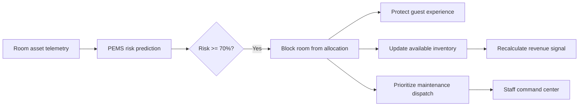
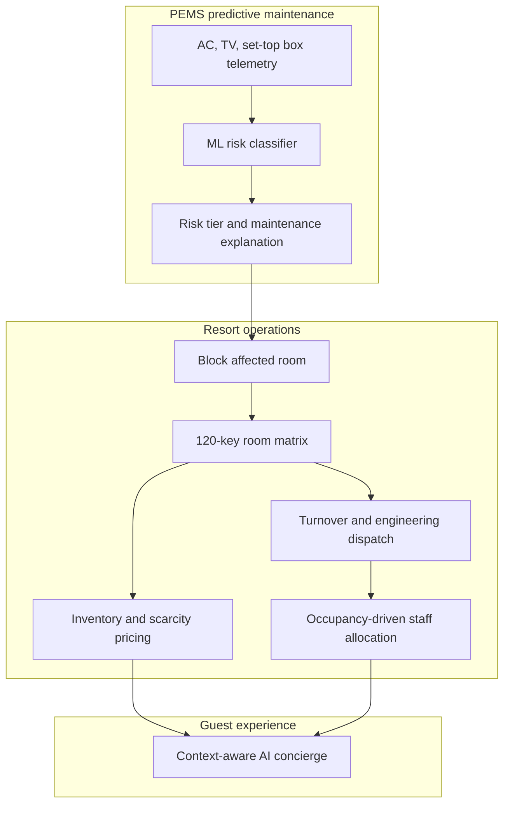
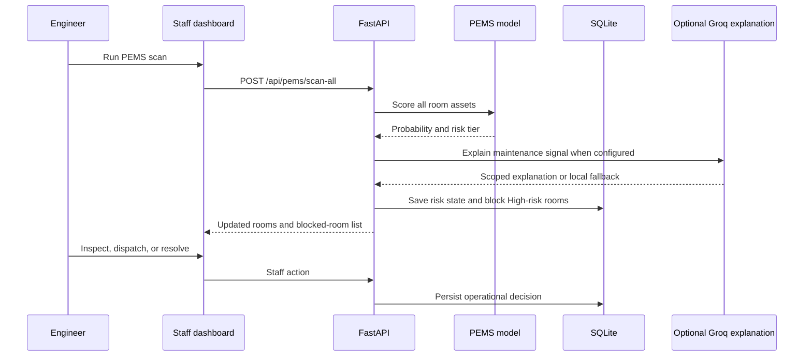

# Resort OS

> **Predict the room problem before the guest experiences it.**

**Resort OS** is a connected intelligence platform for resort operations. Its
unique feature is **PEMS (Predictive Equipment Monitoring System)**: a room-level
machine-learning layer that turns asset telemetry into an operational decision.

PEMS does not stop at predicting that an AC, TV, or set-top box may fail. It
connects that prediction to the rest of the property:



That closed loop is what makes Resort OS different from a conventional hotel
dashboard or a standalone predictive-maintenance model. **The model predicts;
the operating system acts; the team remains in control.**

Built for Hackathon Problem Statement 4, Smart Resort 360, by **The 4Script**.

---

## Why PEMS Is the Differentiator

Most resort software reports room status after a problem has already affected
housekeeping, front desk, engineering, or a guest. Most predictive-maintenance
prototypes end with a probability score. PEMS connects both worlds.

### The PEMS operational loop

1. **Observe**: read power draw, usage hours, operating hours since service,
   error-log count, and asset type for every monitored room asset.
2. **Predict**: score the probability of failure with the trained model loaded
   once at backend startup.
3. **Explain**: return a risk tier, contributing factors, and a concise
   maintenance explanation. GenAI is optional and never replaces the model.
4. **Protect**: when any asset reaches High risk (`>= 70%`), mark its room as
   `Blocked` and set it as excluded from allocation.
5. **Coordinate**: surface the issue to room operations, maintenance dispatch,
   inventory and revenue workflows so the property responds as one system.
6. **Resolve**: a staff member verifies the repair and can return the room to
   service with an explicit resolution action.

### What makes this hard to fake

- **Room-aware, not just asset-aware**: one critical AC can protect an entire
  room from being sold before arrival.
- **Operational consequences are immediate**: the prediction changes the live
  room matrix and inventory signal.
- **Explainable by design**: staff see the telemetry behind the risk instead of
  an unexplained model score.
- **Human approval remains mandatory**: PEMS recommends and protects; staff
  resolve and release rooms.
- **Graceful without an API key**: deterministic local explanations keep the
  full demo functional when Groq is unavailable.

---

## The Connected Resort Intelligence Chain



PEMS is the trigger that makes the modules reactive rather than isolated:

- A critical asset risk blocks a room before front-desk allocation.
- Blocked inventory becomes an input to the revenue recommendation.
- Room and turnover changes inform staffing coverage.
- The staff console provides the engineering and guest-service context in one
  place.

---

## Verified MVP Capabilities

### PEMS predictive maintenance

- Scans **360 assets across 120 rooms**: AC units, TVs, and set-top boxes.
- Uses `power_draw`, `usage_hours`, `operating_hours_since_service`,
  `error_log_count`, and one-hot encoded `asset_type` features.
- Benchmarks Gradient Boosting, Histogram Gradient Boosting, and Random Forest
  candidates with stratified five-fold cross-validation.
- Loads the selected serialized model from `ml/model.pkl` once at startup.
- Classifies risk as Low, Medium, or High. High risk starts at the persisted
  prediction threshold of `0.70`.
- Stores asset risk percentage, status, and explanation in SQLite during a
  property-wide scan.
- Automatically blocks rooms with a High-risk asset and releases only rooms
  whose flagged asset risk has cleared.
- Provides single-asset prediction and model-health endpoints for integration
  and diagnostics.

### Staff operations command center

- Executive dashboard with occupancy, rooms needing attention, staff status,
  revenue signal, and recent activity.
- 120-key room matrix with floor, status, search, and risk filters.
- Room detail drawer with asset telemetry, risk gauges, failure diagnosis,
  allocation exclusion state, technician dispatch, and resolution action.
- Occupancy-based staffing view with department coverage and shift balancing.
- Guest request triage queue synchronized with the guest-facing concierge.
- Revenue view with scarcity reasoning and a guarded rate-adjustment workflow.

### Guest-facing concierge

- Mobile-friendly guest experience at `/guest?room=203`.
- Natural-language requests for dining, spa, activities, late checkout, and
  transport.
- Recommendations use resort context and are copied into the staff triage queue.
- Groq-generated responses are optional; local keyword-based recommendations
  provide a deterministic fallback.

---

## Architecture



**Design rules:**

- The frontend never touches SQLite directly; it uses the API.
- PEMS is the source of truth for risk; GenAI only explains it.
- The model is loaded once and is never retrained per request.
- No room is automatically repaired or released without a staff action.

### Repository structure

```text
ResortOS/
├── backend/
│   ├── main.py              # FastAPI app and PEMS inference endpoints
│   ├── seed.py              # Seeds 120 rooms, 360 assets, departments, and requests
│   ├── requirements.txt     # Runtime dependencies
│   └── resort.db            # Local SQLite database after first run
├── frontend/
│   ├── staff/login.html     # Staff sign-in
│   ├── staff/index.html     # Staff operations command center
│   └── guest/index.html     # Guest concierge
├── ml/
│   ├── model.pkl            # Trained PEMS model artifact
│   ├── train.py             # Model benchmarking and training
│   ├── data_generator.py    # Synthetic room-asset telemetry generator
│   ├── training_data.csv    # Training data
│   └── genai_service.py     # Maintenance explanation adapter
├── Dockerfile
├── render.yaml
└── README.md
```

---

## Quick Start

### Prerequisites

- Python 3.10+
- Optional: a Groq API key for live AI explanations

### Run locally

```bash
git clone https://github.com/The-4Script/ResortOS.git
cd ResortOS/backend
pip install -r requirements.txt
python seed.py
python -m uvicorn main:app --reload --port 8000
```

The database is created automatically when it does not exist. To intentionally
rebuild it locally, run `python seed.py --force`.

### Run the PEMS scan

In another terminal:

```powershell
Invoke-RestMethod -Uri "http://127.0.0.1:8000/api/pems/scan-all" -Method Post
```

Or with curl:

```bash
curl -X POST http://127.0.0.1:8000/api/pems/scan-all
```

The response includes the number of assets updated and the room IDs blocked by
High-risk assets. The seeded demo highlights Rooms 204, 317, and 412.

### Retrain the PEMS model

The repository includes a trained artifact. To regenerate synthetic data and
train a new artifact:

```bash
python ml/data_generator.py
python ml/train.py
```

The training script evaluates candidate classifiers and writes `ml/model.pkl`.

---

## Application URLs

| Interface | URL | Purpose |
|---|---|---|
| Staff sign-in | `http://localhost:8000/login` | Enter the operations console |
| Executive dashboard | `http://localhost:8000/dashboard#dashboard` | Property-wide KPIs and activity |
| Room operations | `http://localhost:8000/dashboard#roomops` | 120-key matrix and PEMS room locks |
| Staff allocations | `http://localhost:8000/dashboard#staff` | Department coverage and shifts |
| Guest queue | `http://localhost:8000/dashboard#guests` | Concierge dispatch workflow |
| Revenue optimization | `http://localhost:8000/dashboard#revenue` | Inventory and rate signals |
| Guest concierge | `http://localhost:8000/guest?room=203` | Guest request experience |
| API documentation | `http://localhost:8000/docs` | FastAPI Swagger UI |

---

## API Reference

| Method | Endpoint | Purpose |
|---|---|---|
| `GET` | `/api/pems/health` | PEMS model, features, threshold, and GenAI status |
| `POST` | `/api/pems/predict` | Predict risk for one room asset |
| `POST` | `/api/pems/scan-all` | Score all 360 assets and block High-risk rooms |
| `GET` | `/api/dashboard` | Aggregated property statistics |
| `GET` | `/api/rooms` | Room status and flagged-asset state |
| `GET` | `/api/rooms/{id}` | Room assets, telemetry, and allocation state |
| `POST` | `/api/rooms/{id}/resolve` | Record resolution and return a room to service |
| `POST` | `/api/rooms/{id}/dispatch` | Record technician dispatch |
| `GET` | `/api/staff` | Staffing recommendations and coverage gaps |
| `GET` | `/api/revenue` | Revenue and scarcity recommendations |
| `POST` | `/api/revenue/apply` | Apply a proposed rate adjustment |
| `POST` | `/api/concierge` | Generate a guest recommendation and queue it |
| `GET` | `/api/guest-requests` | Guest triage queue |
| `PATCH` | `/api/guest-requests/{id}` | Update guest request status or response |
| `POST` | `/api/staff/actions` | Persist a staffing action |
| `POST` | `/api/auth/login` | Validate demo staff credentials |

---

## GenAI Guardrails

PEMS remains useful without GenAI. When configured, Groq turns the structured
prediction into a concise explanation for operations staff using only the
maintenance fields needed for that explanation.

```bash
GROQ_API_KEY=gsk_...
```

The maintenance prompt is scoped to AC, TV, and set-top box upkeep. It does not
make allocation, repair, or replacement decisions. Missing keys, API failures,
or invalid responses fall back to deterministic local templates.

For deployment, set `GROQ_API_KEY` as a server-side secret and configure
`DATABASE_PATH=/data/resort.db` when using persistent storage. Never commit the
API key or use ephemeral storage for a production SQLite database.

---

## Demo Flow

1. Open `/login` and enter the prefilled demo credentials.
2. Open **Room Operations** and run the PEMS scan.
3. Filter **Blocked / Critical** and inspect Room 204's AC telemetry.
4. Show that the room is excluded from allocation because PEMS found a
   critical asset risk.
5. Open **Revenue Optimization** and show the inventory/scarcity response.
6. Dispatch a technician, then use **Mark resolved** to return the room to
   service.
7. Open the guest concierge, submit a request, and show the synchronized staff
   triage item.

The key demonstration is not simply that PEMS predicts failure. It is that one
prediction travels through the property operating system and prevents a guest-
facing failure before it becomes a service incident.

---

## Deployment

The repository includes [`Dockerfile`](./Dockerfile) and
[`render.yaml`](./render.yaml). The container listens on port `7860` for
Hugging Face Spaces and uses the configured FastAPI service for Render.

For Hugging Face Spaces, choose the Docker SDK, push the repository, add
`GROQ_API_KEY` as a secret if needed, attach persistent storage, and set
`DATABASE_PATH=/data/resort.db`. The same persistent-database requirement
applies to Render, Railway, and Fly.io. For multiple service instances,
migrate SQLite to PostgreSQL.

---

## Security and Scope

- All included telemetry and guest data is synthetic.
- API keys are server-side environment variables only.
- Pydantic request models and explicit feature schemas validate inputs.
- The database is not exposed directly to the browser.
- Predictions and operational changes are persisted for auditability.
- Write endpoints are unauthenticated in this MVP and require authentication
  before production use.

---

## Team

**The 4Script** built Resort OS for Hackathon Problem Statement 4:
**Smart Resort 360**.

License: MIT

> **Predict early. Protect the room. Let the team decide.**
