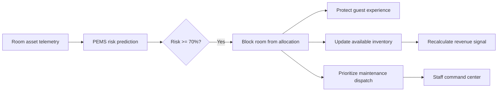
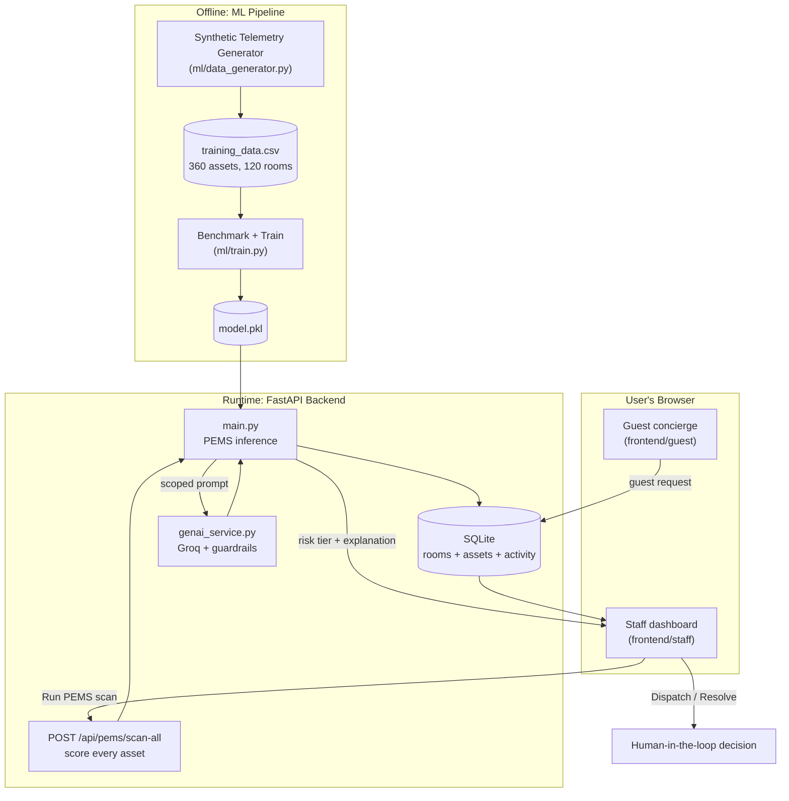
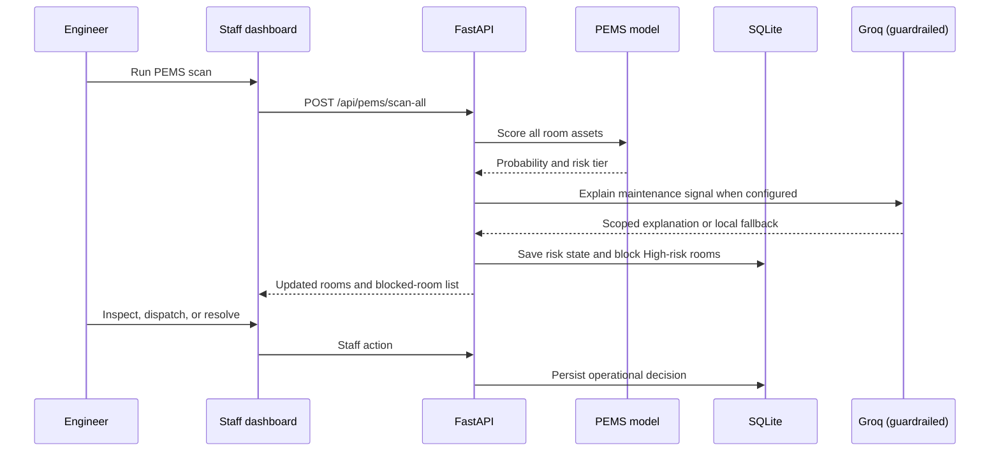

<div align="center">

<pre style="display: inline-block; text-align: left; font-weight: bold; background: none; border: none; padding: 0;">
 ██████╗ ███████╗███████╗ ██████╗ ██████╗ ████████╗     ██████╗ ███████╗
 ██╔══██╗██╔════╝██╔════╝██╔═══██╗██╔══██╗╚══██╔══╝    ██╔═══██╗██╔════╝
 ██████╔╝█████╗  ███████╗██║   ██║██████╔╝   ██║       ██║   ██║███████╗
 ██╔══██╗██╔══╝  ╚════██║██║   ██║██╔══██╗   ██║       ██║   ██║╚════██║
 ██║  ██║███████╗███████║╚██████╔╝██║  ██║   ██║       ╚██████╔╝███████║
 ╚═╝  ╚═╝╚══════╝╚══════╝ ╚═════╝ ╚═╝  ╚═╝   ╚═╝        ╚═════╝ ╚══════╝
</pre>

<br>

**Predict the room problem before the guest experiences it.**

[](#)
[](#license)
[](ml/train.py)
[](backend)
[](#)
[](#-genai-guardrails)
[](Dockerfile)

*Built for Hackathon Problem Statement 4 — Smart Resort 360 — by The 4Script*

</div>

---

## 🔥 The Problem

Resort assets fail without warning. A dead AC or set-top box discovered after
check-in means a guest complaint, an emergency dispatch, and a room pulled
from service mid-stay — all more expensive and more visible than a scheduled
fix would have been.

**PEMS fixes this.** It watches room asset telemetry, tells engineering
*which* assets are at risk *before* they fail, explains *why* in plain
language, and blocks the room from being sold until it's safe. The staff stay
in control — the model only recommends and protects.

---

## ✨ What It Does

PEMS is the predictive layer inside a full resort operations platform — a
closed loop from sensor to staff action.

1. **Observes** — power draw, usage hours, operating hours since service,
   error-log count, and asset type for every monitored AC, TV, and set-top box
2. **Predicts** — scores failure probability with a model trained via
   stratified five-fold cross-validation across Gradient Boosting, Histogram
   Gradient Boosting, and Random Forest candidates
3. **Explains (guardrailed)** — Groq turns the raw prediction into a concise
   maintenance explanation, with a deterministic local fallback if no API key
   is configured
4. **Protects** — any asset at **High risk** (`≥ 70%`) blocks its room from
   allocation immediately
5. **Coordinates** — the block ripples into inventory, revenue, and staffing
   in the same operating system
6. **Resolves** — an engineer verifies the repair and releases the room with
   an explicit resolution action



One scan. Blocked rooms flagged instantly. Plain-language reasoning. Guest
experience protected. Human always resolves.

---

## 🏗️ Architecture



**Three golden rules:**
- The **frontend never touches SQLite** — only through the API.
- **PEMS is the source of truth for risk** — GenAI only explains it.
- The **model loads once at startup** — never retrained per request.

### Request flow



---

## 📊 Model Performance

Benchmarked with stratified five-fold cross-validation across three
candidates; the best performer is serialized to `ml/model.pkl`:

| Candidate | Role |
|---|---|
| Gradient Boosting | Benchmark candidate |
| Histogram Gradient Boosting | Benchmark candidate |
| Random Forest | Benchmark candidate |

| Setting | Value |
|---|---|
| Risk threshold (High) | `≥ 0.70` |
| Assets scanned | 360 (across 120 rooms) |
| Asset types | AC, TV, Set-top box |
| Features | `power_draw`, `usage_hours`, `operating_hours_since_service`, `error_log_count`, one-hot `asset_type` |

> ⚠️ Training data is synthetic, generated to reflect realistic degradation
> patterns — reported as a design sanity check, not a real-world guarantee.

---

## 🔁 The Connected Resort Intelligence Chain

PEMS is the trigger that makes every other module reactive instead of
isolated:

- A critical asset risk blocks a room **before** front-desk allocation.
- Blocked inventory becomes an input to the revenue recommendation.
- Room and turnover changes inform staffing coverage.
- The staff console surfaces engineering and guest-service context in one place.

---

## ✅ Verified MVP Capabilities

### 🔧 PEMS Predictive Maintenance
- Scans **360 assets across 120 rooms**: AC units, TVs, and set-top boxes.
- Classifies risk as **Low**, **Medium**, or **High** at the persisted `0.70` threshold.
- Stores asset risk percentage, status, and explanation in SQLite during a property-wide scan.
- Automatically blocks rooms with a High-risk asset and releases only rooms whose flagged asset risk has cleared.
- Provides single-asset prediction and model-health endpoints for integration and diagnostics.

### 🖥️ Staff Operations Command Center
- Executive dashboard with occupancy, rooms needing attention, staff status, revenue signal, and recent activity.
- 120-key room matrix with floor, status, search, and risk filters.
- Room detail drawer with asset telemetry, risk gauges, failure diagnosis, allocation exclusion state, technician dispatch, and resolution action.
- Occupancy-based staffing view with department coverage and shift balancing.
- Guest request triage queue synchronized with the guest-facing concierge.
- Revenue view with scarcity reasoning and a guarded rate-adjustment workflow.

### 🛎️ Guest-Facing Concierge
- Mobile-friendly guest experience at `/guest?room=203`.
- Natural-language requests for dining, spa, activities, late checkout, and transport.
- Recommendations use resort context and are copied into the staff triage queue.
- Groq-generated responses are optional; local keyword-based recommendations provide a deterministic fallback.

---

## 🔌 GenAI Integration — Guardrailed by Design

Groq's **only job** is to turn a structured PEMS prediction into a concise
maintenance explanation. It never predicts or decides.

| Guardrail | Implementation |
|---|---|
| **Scope lock** | Prompt scoped to AC, TV, and set-top box maintenance |
| **Decision boundary** | Explains only — no allocation, repair, or replacement decisions |
| **Safe fallback** | Missing key, API failure, or invalid response → deterministic local template |
| **Minimal data sent** | Only the maintenance fields needed for the explanation — never raw DB rows |
| **Human-in-the-loop** | Staff dispatch and resolve — PEMS and Groq never act on their own |

```bash
GROQ_API_KEY=gsk_...
```

---

## ⚡ Quick Start

### Prerequisites
- Python 3.10+
- Optional: a Groq API key for live AI explanations

### Clone & install
```bash
git clone https://github.com/The-4Script/ResortOS.git
cd ResortOS/backend
pip install -r requirements.txt
```

### 1 — seed the database
```bash
python seed.py
```
> The database is created automatically when it does not exist. To
> intentionally rebuild it, run `python seed.py --force`.

### 2 — start the backend
```bash
python -m uvicorn main:app --reload --port 8000
```
Backend runs at `http://127.0.0.1:8000` · interactive docs at `http://127.0.0.1:8000/docs`

### 3 — run the PEMS scan
```bash
curl -X POST http://127.0.0.1:8000/api/pems/scan-all
```
Or with PowerShell:
```powershell
Invoke-RestMethod -Uri "http://127.0.0.1:8000/api/pems/scan-all" -Method Post
```
The response includes the number of assets updated and the room IDs blocked by
High-risk assets. The seeded demo highlights **Rooms 204, 317, and 412**.

### 4 — (optional) regenerate data + retrain the model
```bash
python ml/data_generator.py
python ml/train.py
```
> The repo already ships with a trained artifact at `ml/model.pkl` — this step
> is only needed to regenerate from scratch.

### GenAI setup
```bash
GROQ_API_KEY=gsk_your_key_here
```
Without a key, the app automatically falls back to deterministic local
explanations — the demo still works end-to-end.

---

## 🌐 Application URLs

| Interface | URL | Purpose |
|---|---|---|
| Staff sign-in | `http://localhost:8000/login` | Enter the operations console |
| Executive dashboard | `http://localhost:8000/dashboard#dashboard` | Property-wide KPIs and activity |
| Room operations | `http://localhost:8000/dashboard#roomops` | 120-key matrix and PEMS room locks |
| Staff allocations | `http://localhost:8000/dashboard#staff` | Department coverage and shifts |
| Guest queue | `http://localhost:8000/dashboard#guests` | Concierge dispatch workflow |
| Revenue optimization | `http://localhost:8000/dashboard#revenue` | Inventory and rate signals |
| Guest concierge | `http://localhost:8000/guest?room=203` | Guest request experience |
| API documentation | `http://localhost:8000/docs` | FastAPI Swagger UI |

---

## 📂 Repository Structure

```text
ResortOS/
├── backend/
│   ├── main.py              # FastAPI app and PEMS inference endpoints
│   ├── seed.py              # Seeds 120 rooms, 360 assets, departments, and requests
│   ├── requirements.txt     # Runtime dependencies
│   └── resort.db            # Local SQLite database after first run
├── frontend/
│   ├── staff/login.html     # Staff sign-in
│   ├── staff/index.html     # Staff operations command center
│   └── guest/index.html     # Guest concierge
├── ml/
│   ├── model.pkl            # Trained PEMS model artifact
│   ├── train.py             # Model benchmarking and training
│   ├── data_generator.py    # Synthetic room-asset telemetry generator
│   ├── training_data.csv    # Training data
│   └── genai_service.py     # Maintenance explanation adapter
├── Dockerfile
├── render.yaml
└── README.md
```

---

## 🔌 API Reference

| Method | Endpoint | Purpose |
|---|---|---|
| `GET` | `/api/pems/health` | PEMS model, features, threshold, and GenAI status |
| `POST` | `/api/pems/predict` | Predict risk for one room asset |
| `POST` | `/api/pems/scan-all` | Score all 360 assets and block High-risk rooms |
| `GET` | `/api/dashboard` | Aggregated property statistics |
| `GET` | `/api/rooms` | Room status and flagged-asset state |
| `GET` | `/api/rooms/{id}` | Room assets, telemetry, and allocation state |
| `POST` | `/api/rooms/{id}/resolve` | Record resolution and return a room to service |
| `POST` | `/api/rooms/{id}/dispatch` | Record technician dispatch |
| `GET` | `/api/staff` | Staffing recommendations and coverage gaps |
| `GET` | `/api/revenue` | Revenue and scarcity recommendations |
| `POST` | `/api/revenue/apply` | Apply a proposed rate adjustment |
| `POST` | `/api/concierge` | Generate a guest recommendation and queue it |
| `GET` | `/api/guest-requests` | Guest triage queue |
| `PATCH` | `/api/guest-requests/{id}` | Update guest request status or response |
| `POST` | `/api/staff/actions` | Persist a staffing action |
| `POST` | `/api/auth/login` | Validate demo staff credentials |

Interactive docs (try-it-out) live at `http://127.0.0.1:8000/docs`.

---

## 🧰 Built With

| Tool | Role |
|---|---|
| [scikit-learn](https://scikit-learn.org) | PEMS model benchmarking + training |
| [FastAPI](https://fastapi.tiangolo.com) | REST API, validation, auto-docs |
| SQLite | Persistent storage — rooms, assets, activity |
| [Groq](https://groq.com) | GenAI explanation layer (guardrailed) |
| Vanilla JS + HTML/CSS | Staff and guest frontends, no build step |
| Docker | Container for Hugging Face Spaces / Render |

---

## 🎬 Demo Flow

1. Open `/login` and enter the prefilled demo credentials.
2. Open **Room Operations** and run the PEMS scan.
3. Filter **Blocked / Critical** and inspect Room 204's AC telemetry.
4. Show that the room is excluded from allocation because PEMS found a
   critical asset risk.
5. Open **Revenue Optimization** and show the inventory/scarcity response.
6. Dispatch a technician, then use **Mark resolved** to return the room to
   service.
7. Open the guest concierge, submit a request, and show the synchronized staff
   triage item.

> The key demonstration is not simply that PEMS predicts failure. It's that
> one prediction travels through the property operating system and prevents a
> guest-facing failure before it becomes a service incident.

---

## 📦 Deployment

The repository includes [`Dockerfile`](./Dockerfile) and
[`render.yaml`](./render.yaml). The container listens on port `7860` for
Hugging Face Spaces and uses the configured FastAPI service for Render.

For **Hugging Face Spaces**: choose the Docker SDK, push the repository, add
`GROQ_API_KEY` as a secret if needed, attach persistent storage, and set
`DATABASE_PATH=/data/resort.db`.

The same persistent-database requirement applies to **Render**, **Railway**,
and **Fly.io**. For multiple service instances, migrate SQLite to PostgreSQL.

---

## 🔒 Security & Scope

- All included telemetry and guest data is synthetic.
- API keys are server-side environment variables only.
- Pydantic request models and explicit feature schemas validate inputs.
- The database is not exposed directly to the browser.
- Predictions and operational changes are persisted for auditability.

> ⚠️ **Known limitation (MVP):** write endpoints are unauthenticated — acceptable
> for a hackathon demo, not for production use.

---

## 👥 Team 4Script

Built for Hackathon Problem Statement 4: **Smart Resort 360**.

---

## 📄 License

MIT — use it, fork it, learn from it.

---

<div align="center">
<i>Predict early. Protect the room. Let the team decide.</i>
</div>
