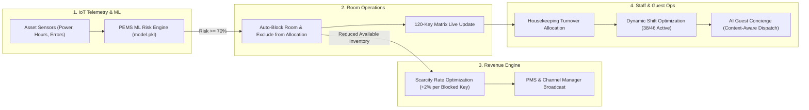

# Resort OS — Smart Resort 360

> **Connected Intelligence Platform for Autonomous Luxury Resort Operations**  
> *Hackathon PS4: Smart Resort 360 — Built by Team The 4Script*

Resort OS is an enterprise-grade hospitality operating system that eliminates operational silos by uniting **predictive asset maintenance (PEMS)**, **turnover & room matrix operations**, **algorithmic yield revenue management**, **occupancy-driven staff scheduling**, and **AI-powered guest concierge dispatch** into a unified, reactive command center.

---

## 🌟 The Connected Intelligence Chain

Most hospitality dashboards operate in isolation. Resort OS connects all modules into a reactive causal chain:



1. **Predictive IoT Telemetry**: Telemetry from room assets (AC, TV, STB) is processed by an embedded **PEMS ML classifier**.
2. **Proactive Room Blocking**: Any critical asset failure risk ($\ge 70\%$) immediately marks the room as `Blocked` and sets `excluded_from_allocation = true` to prevent front-desk booking errors.
3. **Yield Management & Scarcity Pricing**: Blocked inventory reduces available capacity. The revenue engine immediately recalibrates dynamic ADR rates ($+2\%$ per blocked room of that category).
4. **Staff Dynamic Balancing**: Room turnover status drives departmental allocations across 5 sectors to prevent housekeeping bottlenecks.
5. **AI Guest Concierge Dispatch**: Guest requests are evaluated against live resort occupancy, kitchen load, and staffing levels to generate optimal recommendations.

---

## ✅ Verified & Delivered (100% Complete)

Every single component, endpoint, view, and button has been swept end-to-end and verified with zero console errors.

### 🧠 Backend & ML Engine (FastAPI + SQLite + Scikit-Learn)
- [x] **PEMS Predictive Maintenance**: Pre-trained Scikit-Learn classifier (`ml/model.pkl`) evaluating power draw, total usage hours, hours since last service, error log counts, and asset type one-hot encodings.
- [x] **Property-Wide Telemetry Scan**: `POST /api/pems/scan-all` evaluates all 360 room assets across 120 rooms and dynamically blocks high-risk rooms (e.g. Rooms 204, 317, 412).
- [x] **Health & Diagnostics**: `GET /api/pems/health` reports model status, feature columns, and GenAI availability.
- [x] **Rooms Inventory API**: `GET /api/rooms` returns all 120 rooms with statuses (`Ready`, `Occupied`, `Dirty`, `Blocked`, `Arrival`) and `has_flagged_asset` flags.
- [x] **Room Detail Telemetry API**: `GET /api/rooms/{id}` returns individual asset risks, operational reasons, and allocation exclusion status.
- [x] **Occupancy Staffing API**: `GET /api/staff` returns real-time occupancy benchmark, active vs recommended headcount, and departmental coverage gaps.
- [x] **Yield Revenue API**: `GET /api/revenue` computes dynamic pricing recommendations with property-wide scarcity reasoning.
- [x] **Executive Dashboard API**: `GET /api/dashboard` aggregates real-time property health, occupancy percentage, turnover counts, and revenue signals.
- [x] **AI Concierge API**: `POST /api/concierge` provides context-aware dining, spa, and activity recommendations with automated triage queue logging.
- [x] **Guest Queue API**: `GET /api/guest-requests` delivers live triage feed for staff dispatch.
- [x] **Database Seeding**: `backend/seed.py` creates 120 rooms, 360 assets, 5 departments, and guest request queue.

---

### 🖥️ Staff Operations Hub (Unified SPA)
- [x] **Authentication Screen (`/login`)**:
  - Pre-filled General Manager credentials (Alex Morgan).
  - Password visibility toggle (`password` $\leftrightarrow$ `text`).
  - Animated authentication spinner and auto-redirect to `/dashboard#dashboard`.
- [x] **Executive Dashboard (`#dashboard`)**:
  - 4 Live Stat Cards (Occupancy, Rooms Needing Attention, Staff Status, Revenue Signal) wired directly to navigation tabs.
  - Interactive Donut Chart showing real-time distribution across all 120 keys.
  - Recent Activity Feed with direct drill-down links (e.g., clicking Room 204 opens its drawer).
  - Header search and maintenance alert notification bell with visual toast feedback.
- [x] **120-Key Room Operations Matrix (`#roomops`)**:
  - Multi-floor grid representing Levels 01 to 04 (Lobby, Garden, Ocean, and Penthouse wings).
  - Real-time status indicators (Ready: Green, Occupied: Blue, Dirty: Amber, Blocked: Red, Arrival: Orange).
  - Interactive Filter Tabs: **All Rooms**, **Blocked / Critical**, **Ready**, **Occupied**, **Dirty**, **Arrival**.
  - Real-time room number and category search bar.
  - Interactive Asset Telemetry Drawer: sliding right drawer with asset health telemetry (AC, TV, STB), risk gauge charts, and failure diagnosis.
  - **Mark Resolved Action**: Session-persisted room clearance updating room status to Ready and adjusting property-wide blocked counters.
  - **Assign Technician Action**: Automated dispatch notification with toast confirmation.
- [x] **Staff Department Allocations (`#staff`)**:
  - Live occupancy benchmark banner (39% live, 38 / 46 active staff, -8 deficit).
  - 5 Sector Allocation Cards: Housekeeping, Front Desk & Concierge, Kitchen & Culinary, Facilities & Engineering, Spa & Wellness.
  - Visual coverage progress bars and headcount deficit indicators.
  - **Auto-adjust shifts**: Interactive shift balancing animation and optimization toast.
  - **Export roster**: Roster generation feedback and download confirmation toast.
  - Sector-specific action buttons: Reassign, Call backup pool, and View roster.
- [x] **Guest Concierge Triage Queue (`#guests`)**:
  - Live triage feed displaying guest requests, operational context, and pre-composed recommendations.
  - Synchronized Filter Tabs: **All Requests**, **Pending Review**, **Sent**.
  - Real-time text search filtering across guest names and room inquiries.
  - **Send to guest**: Flips status badge from Pending to Sent, updates action row to "Sent just now by Alex Morgan", and displays confirmation toast.
  - Interactive **Edit response** and **View message** inspection modals.
- [x] **Algorithmic Revenue Management (`#revenue`)**:
  - Dynamic Rate Optimization Hero Card with target category, suggested adjustment, base rate, and suggested rate.
  - Scarcity reasoning explicitly tracking category and property-wide blocked keys.
  - Yield Pulse sidebar comparing portfolio RevPAR, ADR, and committed keys.
  - **Apply adjustment**: Broadcasts rate change to PMS and Channel Manager with green status update.
  - **Dismiss**: Dims recommendation card and disables action for 4 hours.
  - 5-Category Breakdown Table (Standard, Deluxe, Deluxe AC, Suite, Penthouse) with inventory and occupancy progress.

---

### 📱 Guest-Facing AI Concierge (`/guest?room=203`)
- [x] Standalone guest chat interface parameterized by URL query (`?room=203`).
- [x] Animated three-dot typing indicator simulating concierge review.
- [x] Pre-configured quick request chips:
  - 🍽️ *Dinner reservation* (Mare Nostrum 7:30 PM off-peak dining recommendation).
  - 💆 *Spa booking* (Lagoon Cabana couples deep tissue massage).
  - ⏰ *Late checkout* (12:30 PM complimentary buffer checkout).
  - 🚗 *Airport transfer* (Private luxury hybrid shuttle pickup).
  - 🏊 *Pool & activities* (Cabana reservation & sunset yoga).
- [x] Free-form natural language query submission with live responses from `/api/concierge`.
- [x] Automated bidirectional synchronization into the staff triage queue.

---

## 📐 System Architecture & Directory Structure

```
resortos/
├── backend/
│   ├── main.py              # FastAPI app — all 9 API endpoints + static file routing
│   ├── seed.py              # SQLite database seeder (120 keys, 360 assets, 5 depts)
│   ├── resort.db            # Local SQLite database (use a mounted volume in production)
│   └── requirements.txt     # fastapi, uvicorn, scikit-learn, pydantic
├── frontend/
│   ├── staff/
│   │   ├── login.html       # Authentication workstation screen
│   │   └── index.html       # Staff Operations Command Center SPA (5 views)
│   └── guest/
│       └── index.html       # Guest AI Concierge Chat UI
├── ml/
│   ├── model.pkl            # Pre-trained PEMS predictive risk classifier
│   ├── train.py             # Random forest training pipeline
│   ├── data_generator.py    # Synthetic IoT sensor stream generator
│   └── genai_service.py     # Groq explanation adapter
├── walkthrough.md           # End-to-end verification and audit log
└── README.md                # System documentation
```

### Groq configuration

The app uses Groq's OpenAI-compatible streaming API with model
`openai/gpt-oss-120b` for concierge and maintenance explanations. Set the key
only as a server-side environment variable; never commit it to the repository:

```bash
GROQ_API_KEY=gsk_...
```

If the variable is absent or Groq is unavailable, the existing deterministic
local recommendations/templates are used.

### Live deployment

#### Hugging Face Spaces

1. Create a new Space at [huggingface.co/new-space](https://huggingface.co/new-space).
2. Choose **Docker** as the Space SDK and select the hardware you need.
3. Set the Space visibility, then copy the Space Git URL.
4. Add the Space as a remote and push this repository:

```bash
git remote add space https://huggingface.co/spaces/<your-username>/<your-space>
git push space main
```

5. In **Settings > Variables and secrets**, add `GROQ_API_KEY` as a secret if AI-generated responses are required. The app works without it using local fallback recommendations.
6. In **Settings > Storage**, attach persistent storage. The app is configured to use `/data/resort.db` when `DATABASE_PATH=/data/resort.db` is set. Without attached storage, database changes are lost when the Space restarts or rebuilds.
7. In **Settings > Variables**, set `DATABASE_PATH` to `/data/resort.db`, then restart the Space. Open `/login` on the resulting `https://<your-space>.hf.space` URL.

The container listens on port `7860`, and the Space metadata at the top of this file selects the Docker runtime automatically. The database seeds itself only when the configured database file is absent. To intentionally rebuild it locally, run `python backend/seed.py --force`; do not run that command against a live persistent database unless a reset is wanted.

This repository includes a [`Dockerfile`](./Dockerfile) and
[`render.yaml`](./render.yaml) for Render. Render is the simplest option for
this single FastAPI service: create a Blueprint from the repository, add
`GROQ_API_KEY` in the dashboard, and deploy. The included 1 GB persistent disk
mounts SQLite at `/data/resort.db`, so guest requests and status changes survive
restarts. Persistent disks require a paid Render web service.

Railway with a mounted volume or Fly.io with a volume are also suitable. Do not
use an ephemeral filesystem for production SQLite, because redeploys will erase
the database. For multiple production instances, migrate SQLite to PostgreSQL
instead; SQLite on one mounted volume is intended for a single service instance.

---

## 🚀 Quick Start

### 1. Prerequisites
- Python 3.10+
- Node.js (optional, for script testing)

### 2. Installation & Server Startup

```bash
# Clone the repository
git clone https://github.com/The-4Script/ResortOS.git
cd resortos/backend

# Install dependencies
pip install -r requirements.txt

# Seed the database (creates 120 rooms, 360 assets, 5 depts)
python seed.py

# Start the backend server
python -m uvicorn main:app --reload --port 8000
```

### 3. Initialize Live PEMS Asset Telemetry

In another terminal, trigger the PEMS ML pipeline scan across all room assets:

```bash
# Windows PowerShell
Invoke-RestMethod -Uri "http://127.0.0.1:8000/api/pems/scan-all" -Method Post

# macOS / Linux / curl
curl -X POST http://127.0.0.1:8000/api/pems/scan-all
```

*Result:* `{"assets_updated": 360, "rooms_blocked": 3, "blocked_room_ids": [204, 317, 412]}`

---

## 🌐 Application URLs

| Interface | URL | Purpose |
|---|---|---|
| **Staff Sign-In** | [`http://localhost:8000/login`](http://localhost:8000/login) | Workstation login & credentials |
| **Executive Dashboard** | [`http://localhost:8000/dashboard#dashboard`](http://localhost:8000/dashboard#dashboard) | Property KPI overview & activity |
| **Room Operations** | [`http://localhost:8000/dashboard#roomops`](http://localhost:8000/dashboard#roomops) | 120-key matrix, filters, drawer |
| **Staff Allocations** | [`http://localhost:8000/dashboard#staff`](http://localhost:8000/dashboard#staff) | Shift balancing & roster management |
| **Guest Queue** | [`http://localhost:8000/dashboard#guests`](http://localhost:8000/dashboard#guests) | AI recommendation dispatch queue |
| **Revenue Optimization** | [`http://localhost:8000/dashboard#revenue`](http://localhost:8000/dashboard#revenue) | Dynamic pricing & yield guardrails |
| **Guest Concierge** | [`http://localhost:8000/guest?room=203`](http://localhost:8000/guest?room=203) | Guest-facing mobile concierge chat |
| **API Documentation** | [`http://localhost:8000/docs`](http://localhost:8000/docs) | Interactive Swagger API docs |

---

## 🔌 API Reference Summary

### Core Endpoints

| Method | Endpoint | Description |
|---|---|---|
| `GET` | `/api/dashboard` | Aggregated property statistics (occupancy, attention keys, staff, signal). |
| `GET` | `/api/rooms` | Array of 120 rooms with turnover status and fault flags. |
| `GET` | `/api/rooms/{id}` | Room details with asset sensor telemetry (AC, TV, STB) and exclusion flag. |
| `POST` | `/api/rooms/{id}/resolve` | Persist a staff-confirmed room resolution and return it to Ready status. |
| `GET` | `/api/staff` | Departmental allocations, recommended headcount, and coverage gaps. |
| `GET` | `/api/revenue` | Algorithmic rate adjustments per room type based on occupancy and scarcity. |
| `POST` | `/api/concierge` | AI recommendation generation and automatic staff triage logging. |
| `GET` | `/api/guest-requests` | Feed of guest requests with recommendations and dispatch statuses. |
| `POST` | `/api/pems/scan-all` | Runs ML predictive maintenance across all 360 assets and auto-blocks high-risk rooms. |
| `GET` | `/api/pems/health` | Diagnostic endpoint checking ML model availability and feature columns. |

---

## 🎬 3-Minute Demo Walkthrough Guide

Follow this sequence for an optimal live demonstration:

1. **Sign In**: Visit `/login`, click **Sign in to console** $\rightarrow$ smooth transition into `/dashboard`.
2. **Review High-Level Metrics**: Point out the live **Occupancy (39%)**, **Rooms Needing Attention (10)**, and the **Revenue Signal (+4%)**.
3. **Inspect the Room Matrix**:
   - Navigate to `#roomops`.
   - Click the **Blocked / Critical** filter tab $\rightarrow$ isolates the 6 blocked rooms (including PEMS-flagged 204, 317, 412).
   - Click **Room 204** $\rightarrow$ inspect the drawer showing **AC Unit at 87% Critical Risk**.
   - Click **Mark resolved** $\rightarrow$ room transitions to Ready, drawer closes, and dashboard counter drops.
4. **Demonstrate Dynamic Revenue Response**:
   - Navigate to `#revenue`.
   - Show how the hero card highlights Deluxe scarcity pricing triggered by blocked room count.
   - Click **Apply adjustment** $\rightarrow$ status updates to "Applied to PMS".
5. **Demonstrate Guest AI Concierge & Live Dispatch**:
   - Open `/guest?room=203` in a new window.
   - Click **Dinner reservation** $\rightarrow$ AI concierge recommends Mare Nostrum at 7:30 PM with operational rationale.
   - Switch to `#guests` in the staff console $\rightarrow$ the request is already logged in the queue.
   - Click **Send to guest** $\rightarrow$ card flips to "Sent" status with Alex Morgan's timestamp.
6. **Balance Staffing**:
   - Navigate to `#staff`.
   - Click **Auto-adjust shifts** $\rightarrow$ shift optimization executes with live visual feedback.

---

## 👥 The Team

**The 4Script**
- Developed for Hackathon Problem Statement 4: *Smart Resort 360*
- License: MIT
